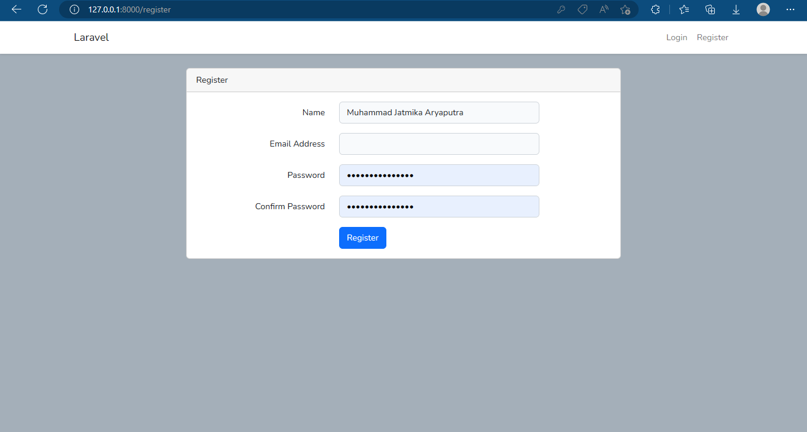
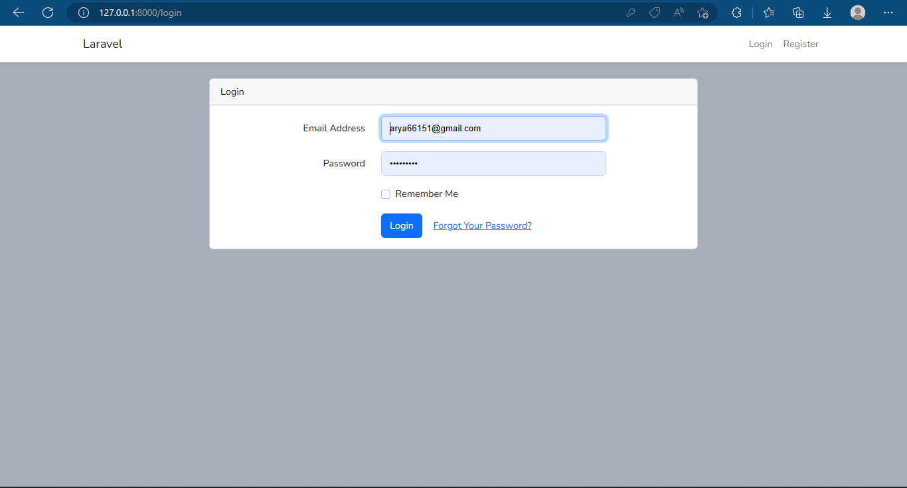
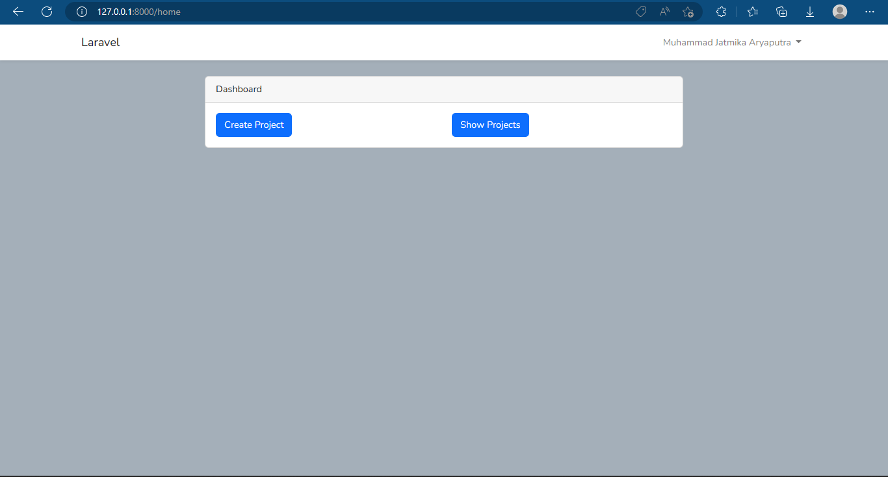

<h1>Profile</h1>
Nama: Muhammad Jatmika Aryaputra

Instansi: Universitas Lambung 

Semester: 7

Domisili: Banjarmasin

<h1> Tampilan Register</h1>

<h1> Tampilan Login</h1>

<h1> Tampilan Home</h1>

<h1> Tampilan Index Projects</h1>

<h1> Tampilan Create Project</h1>

<h1> Tampilan Edit Project</h1>

<h1>How to run the project</h1>

Open a terminal window and navigate to the directory where you want to clone the repository.

Run the command <pre><code>git clone https://github.com/TrigrD3/WebDev-Digitaliz.git</code></pre>. This will create a new directory with the same name as the repository and download all the files inside it.

Change directory into the cloned repository by running the command <pre><code>cd WebDev-Digitaliz</code></pre>

Run <pre><code>composer install</code></pre> to install all the necessary dependencies

Run <pre><code>npm install</code></pre> to install all the necessary dependencies

Run <pre>npm run dev<code></code></pre> to compile the assets

Run <pre><code>php artisan key:generate</code></pre> to generate a new encryption key for your application

Run <pre>php artisan serve<code></code></pre> to start the built-in PHP web server and access the application in your web browser by navigating to http://localhost:8000

<h1>Database</h1>
I'm using MySQL database. You can change the database in .env file if there is no .env file, just make a new one and copy the content from .env.example file.

username: root

password: root
